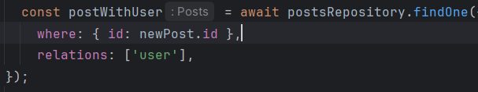

<h2>1. Створити нову сутність Post:</h2>
<ul>
  <li>Визначити поля:
    <ul>
      <li><code>id</code>: UUID, первинний ключ</li>
      <li><code>title</code>: рядок, обов’язковий</li>
      <li><code>content</code>: текст, необов’язковий</li>
      <li><code>createdAt</code>: дата створення, автоматично заповнюється</li>
      <li><code>updatedAt</code>: дата оновлення, автоматично оновлюється</li>
    </ul>
  </li>
</ul>

<h2>2. Створити та застосувати міграцію:</h2>
<ul>
  <li>Згенерувати міграцію для нової сутності.</li>
  <li>Запустити міграцію через CLI.</li>
  <li>Перевірити у базі даних (наприклад, через pgAdmin або консоль), що структура таблиці відповідає очікуваній.</li>
</ul>

<h2>3. Реалізувати RESTful API для CRUD-операцій:</h2>
<ul>
  <li><strong>Create:</strong> створення нового поста</li>
  <li><strong>Read:</strong>
    <ul>
      <li>отримання всіх постів</li>
      <li>отримання одного поста за ID</li>
    </ul>
  </li>
  <li><strong>Update:</strong> оновлення поста за ID</li>
  <li><strong>Delete:</strong> видалення поста за ID</li>
  <li>Використовувати контролер, DTO, роутер та сервіс за прикладом реалізації для User.</li>
</ul>

 
<h2>4. [Опціонально, для підвищення оцінки] Налагодити зв’язок між User і Post:</h2>
<ul>
  <li>Один користувач може мати багато постів.</li>
  <li>У моделі Post додати поле <code>user</code> з типом <code>ManyToOne</code>, що вказує на User.</li>
  <li>У моделі User додати поле <code>posts</code> з типом <code>OneToMany</code>.</li>
  <li>При відповіді через API:
    <ul>
      <li>у кожному пості має бути вкладена інформація про користувача (без пароля),</li>
      <li>у відповіді на запит користувача — масив його постів.</li>
    </ul>
  </li>
</ul>

 
 
<h2>5. Протестувати REST API через Postman:</h2>
<ul>
  <li>Створити окрему колекцію для запитів.</li>
  <li>Додати приклади:
    <ul>
      <li>створення поста,</li>
      <li>отримання всіх постів,</li>
      <li>отримання поста за ID,</li>
      <li>оновлення поста,</li>
      <li>видалення поста,</li>
      <li>[опціонально] отримання постів разом із користувачем та навпаки.</li>
    </ul>
  </li>
  <li>Переконатися, що кожен ендпоінт працює відповідно до очікувань.</li>
</ul>

 
 
 
